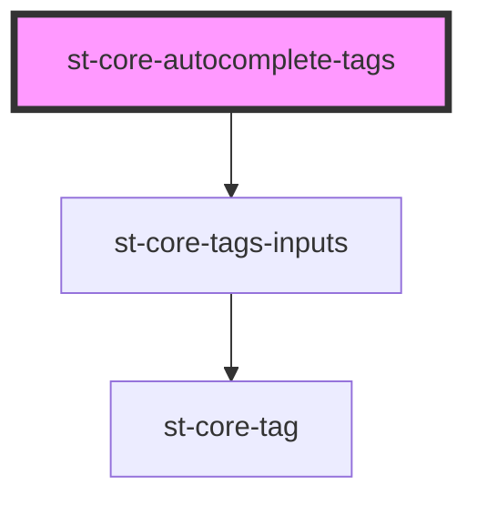

# st-core-autocomplete-tags

<!-- Auto Generated Below -->

## Properties

| Property        | Attribute       | Description | Type       | Default     |
| --------------- | --------------- | ----------- | ---------- | ----------- |
| `canEnter`      | `can-enter`     |             | `boolean`  | `false`     |
| `cleanFilter`   | --              |             | `any[]`    | `[]`        |
| `placeholder`   | `placeholder`   |             | `string`   | `undefined` |
| `searchLength`  | `search-length` |             | `number`   | `2`         |
| `tags`          | --              |             | `string[]` | `undefined` |
| `tagsToSuggest` | --              |             | `string[]` | `[]`        |

## Events

| Event            | Description | Type                    |
| ---------------- | ----------- | ----------------------- |
| `selectElements` |             | `CustomEvent<string[]>` |

## Dependencies

### Depends on

- [st-core-tags-inputs](../st-core-tags-inputs)

### Graph

----------------------------------------------

*Built with [StencilJS](https://stenciljs.com/)*
