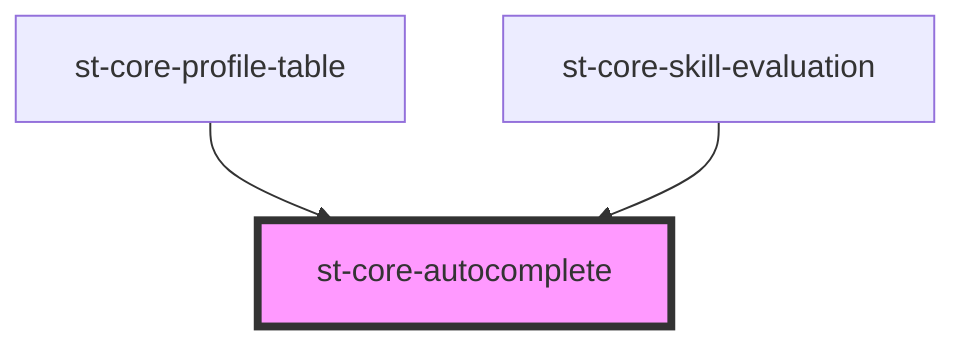

# st-core-autocomplete

<!-- Auto Generated Below -->

## Properties

| Property          | Attribute           | Description | Type      | Default          |
| ----------------- | ------------------- | ----------- | --------- | ---------------- |
| `data`            | --                  |             | `any[]`   | `[]`             |
| `displayField`    | `display-field`     |             | `string`  | `undefined`      |
| `emitMode`        | `emit-mode`         |             | `boolean` | `true`           |
| `inputClassField` | `input-class-field` |             | `string`  | `'form-control'` |
| `isDisabled`      | `is-disabled`       |             | `boolean` | `undefined`      |
| `searchLength`    | `search-length`     |             | `number`  | `2`              |
| `value`           | `value`             |             | `string`  | `undefined`      |
| `valueField`      | `value-field`       |             | `string`  | `undefined`      |

## Events

| Event         | Description | Type               |
| ------------- | ----------- | ------------------ |
| `inputValue`  |             | `CustomEvent<any>` |
| `selectValue` |             | `CustomEvent<any>` |

## Methods

### `cleanDatalist() => Promise<void>`

#### Returns

Type: `Promise<void>`

## Shadow Parts

| Part              | Description |
| ----------------- | ----------- |
| `"auto-complete"` |             |

## Dependencies

### Used by

 - [st-core-profile-table](../st-core-profile-table)
 - [st-core-skill-evaluation](../skill-evaluation)

### Graph

----------------------------------------------

*Built with [StencilJS](https://stenciljs.com/)*
