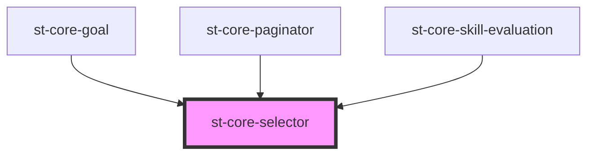

# core-selector

<!-- Auto Generated Below -->

## Properties

| Property      | Attribute      | Description | Type             | Default     |
| ------------- | -------------- | ----------- | ---------------- | ----------- |
| `classSelect` | `class-select` |             | `string`         | `undefined` |
| `isDisabled`  | `is-disabled`  |             | `boolean`        | `false`     |
| `name`        | `name`         |             | `string`         | `undefined` |
| `options`     | --             |             | `OptionsModel[]` | `undefined` |
| `placeholder` | `placeholder`  |             | `string`         | `undefined` |
| `selected`    | `selected`     |             | `any`            | `undefined` |
| `value`       | `value`        |             | `any`            | `undefined` |

## Events

| Event           | Description | Type               |
| --------------- | ----------- | ------------------ |
| `selectElement` |             | `CustomEvent<any>` |

## Dependencies

### Used by

 - [st-core-goal](../st-core-goal)
 - [st-core-paginator](../st-core-paginator)
 - [st-core-skill-evaluation](../skill-evaluation)

### Graph

----------------------------------------------

*Built with [StencilJS](https://stenciljs.com/)*
