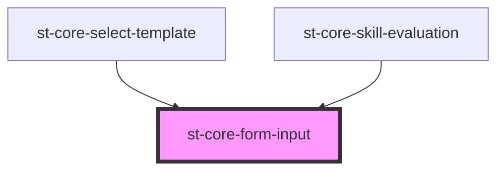

# st-core-form-input

<!-- Auto Generated Below -->

## Properties

| Property       | Attribute       | Description | Type      | Default     |
| -------------- | --------------- | ----------- | --------- | ----------- |
| `classForm`    | `class-form`    |             | `string`  | `null`      |
| `errorMsg`     | `error-msg`     |             | `any`     | `undefined` |
| `errors`       | `errors`        |             | `any`     | `undefined` |
| `labelText`    | `label-text`    |             | `string`  | `undefined` |
| `showRequired` | `show-required` |             | `boolean` | `undefined` |
| `showSort`     | `show-sort`     |             | `boolean` | `false`     |
| `sortAsc`      | `sort-asc`      |             | `boolean` | `true`      |

## Events

| Event          | Description | Type                   |
| -------------- | ----------- | ---------------------- |
| `sendAscOrder` |             | `CustomEvent<boolean>` |

## Dependencies

### Used by

 - [st-core-select-template](../select-template)
 - [st-core-skill-evaluation](../skill-evaluation)

### Graph

----------------------------------------------

*Built with [StencilJS](https://stenciljs.com/)*
