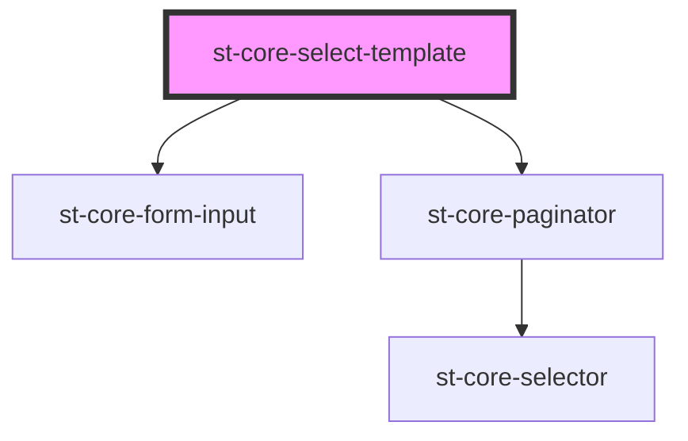

# Select Template

## Use

```xml
<st-core-select-template data={dataArray} onSendTemplateId={e => this.myFunc(e)}>
</st-core-select-template>
```

@data structure:

```js
const dataArray = [
  {
    formId: 'string',
    name: 'string',
  },
];
```

## non-JSX

```html
<st-core-select-template></st-core-select-template>
<script>
  const myComp = document.querySelector('st-core-select-template');
  myComp.data = dataArray;
  myComp.addEventListener('sendTemplateId', (e) => {
    console.log(e.detail);
    // ...
  });
</script>
```

## React

To pass object/array data and listen events in React:

```jsx
el = useRef();

useEffect(() => {
  el.current.data = dataArray;
  el.current.addEventListener('sendTemplateId', (e) => {
    console.log(e.detail);
    // ...
  });
});

// render
<st-core-select-template ref={el} />;
```

<!-- Auto Generated Below -->


## Properties

| Property      | Attribute      | Description | Type            | Default     |
| ------------- | -------------- | ----------- | --------------- | ----------- |
| `data`        | --             |             | `AssesFormat[]` | `[]`        |
| `disableEdit` | `disable-edit` |             | `boolean`       | `false`     |
| `page`        | `page`         |             | `number`        | `1`         |
| `pageSize`    | `page-size`    |             | `number`        | `20`        |
| `totalItems`  | `total-items`  |             | `number`        | `undefined` |


## Events

| Event            | Description | Type                          |
| ---------------- | ----------- | ----------------------------- |
| `changePage`     |             | `CustomEvent<any>`            |
| `changePageSize` |             | `CustomEvent<any>`            |
| `sendFilters`    |             | `CustomEvent<TemplateFilter>` |
| `sendTemplateId` |             | `CustomEvent<string>`         |


## Dependencies

### Depends on

- [st-core-form-input](../form-input)
- [st-core-paginator](../st-core-paginator)

### Graph


----------------------------------------------

*Built with [StencilJS](https://stenciljs.com/)*
