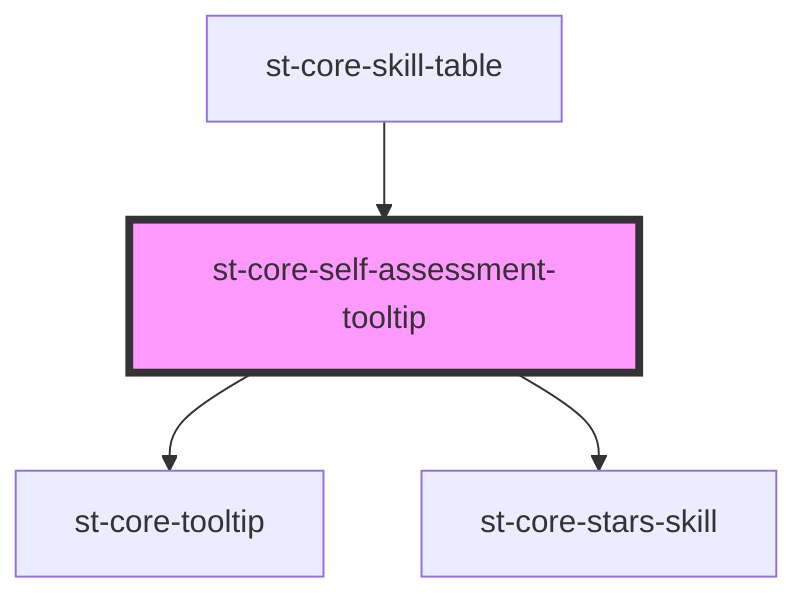

# st-core-self-assessment-tooltip

<!-- Auto Generated Below -->

## Properties

| Property   | Attribute   | Description | Type             | Default     |
| ---------- | ----------- | ----------- | ---------------- | ----------- |
| `isAdmin`  | `is-admin`  |             | `boolean`        | `false`     |
| `showText` | `show-text` |             | `boolean`        | `true`      |
| `skill`    | --          |             | `UserSkillModel` | `undefined` |

## Events

| Event                | Description | Type                               |
| -------------------- | ----------- | ---------------------------------- |
| `sendSelfAssessment` |             | `CustomEvent<SelfAssessmentModel>` |

## Dependencies

### Used by

 - [st-core-skill-table](../st-core-skill-table)

### Depends on

- [st-core-tooltip](../st-core-tooltip)
- [st-core-stars-skill](../skill-evaluation/components/stars-skill)

### Graph

----------------------------------------------

*Built with [StencilJS](https://stenciljs.com/)*
