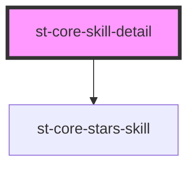

# skill-detail

<!-- Auto Generated Below -->

## Properties

| Property     | Attribute     | Description | Type                                            | Default     |
| ------------ | ------------- | ----------- | ----------------------------------------------- | ----------- |
| `info`       | --            |             | `{ userSkill: UserSkillModel; index: number; }` | `undefined` |
| `levelsEnum` | `levels-enum` |             | `any`                                           | `undefined` |

## Dependencies

### Depends on

- [st-core-stars-skill](../skill-evaluation/components/stars-skill)

### Graph

----------------------------------------------

*Built with [StencilJS](https://stenciljs.com/)*
