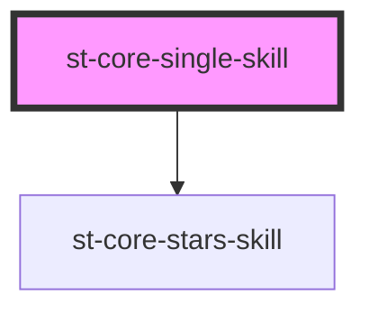

# st-core-single-skill

<!-- Auto Generated Below -->

## Properties

| Property           | Attribute            | Description | Type         | Default     |
| ------------------ | -------------------- | ----------- | ------------ | ----------- |
| `identification`   | `identification`     |             | `string`     | `undefined` |
| `inputChangeEvent` | `input-change-event` |             | `any`        | `undefined` |
| `readOnly`         | `read-only`          |             | `boolean`    | `false`     |
| `skill`            | --                   |             | `SkillModel` | `undefined` |
| `translation`      | `translation`        |             | `any`        | `undefined` |

## Dependencies

### Depends on

- [st-core-stars-skill](../stars-skill)

### Graph

----------------------------------------------

*Built with [StencilJS](https://stenciljs.com/)*
