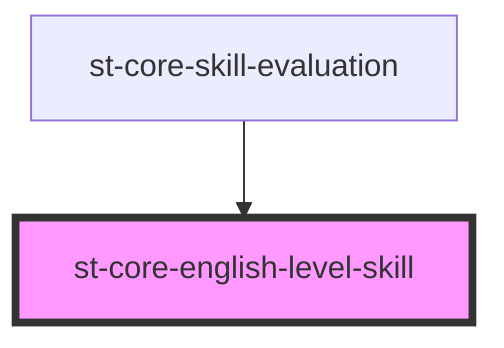

# st-core-english-level-skill

<!-- Auto Generated Below -->

## Properties

| Property   | Attribute  | Description | Type                   | Default     |
| ---------- | ---------- | ----------- | ---------------------- | ----------- |
| `disabled` | `disabled` |             | `boolean`              | `false`     |
| `level`    | `level`    |             | `number`               | `undefined` |
| `size`     | `size`     |             | `"md" \| "sm" \| "xs"` | `'xs'`      |

## Events

| Event           | Description | Type                                             |
| --------------- | ----------- | ------------------------------------------------ |
| `selectedLevel` |             | `CustomEvent<{ level: number; label: string; }>` |

## Dependencies

### Used by

 - [st-core-skill-evaluation](../..)

### Graph

----------------------------------------------

*Built with [StencilJS](https://stenciljs.com/)*
