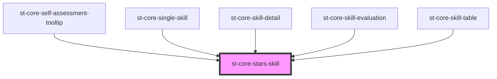

# st-core-stars-skill

<!-- Auto Generated Below -->

## Properties

| Property        | Attribute         | Description | Type                   | Default     |
| --------------- | ----------------- | ----------- | ---------------------- | ----------- |
| `definedLevel`  | `defined-level`   |             | `boolean`              | `false`     |
| `level`         | `level`           |             | `number`               | `undefined` |
| `name`          | `name`            |             | `string`               | `undefined` |
| `position`      | `position`        |             | `string`               | `'center'`  |
| `showZeroLevel` | `show-zero-level` |             | `boolean`              | `false`     |
| `size`          | `size`            |             | `"md" \| "sm" \| "xs"` | `'xs'`      |

## Events

| Event          | Description | Type                  |
| -------------- | ----------- | --------------------- |
| `selectedStar` |             | `CustomEvent<number>` |

## Methods

### `resetStars() => Promise<void>`

#### Returns

Type: `Promise<void>`

## Dependencies

### Used by

 - [st-core-self-assessment-tooltip](../../../self-assessment-tooltip)
 - [st-core-single-skill](../single-skill)
 - [st-core-skill-detail](../../../skill-detail)
 - [st-core-skill-evaluation](../..)
 - [st-core-skill-table](../../../st-core-skill-table)

### Graph

----------------------------------------------

*Built with [StencilJS](https://stenciljs.com/)*
