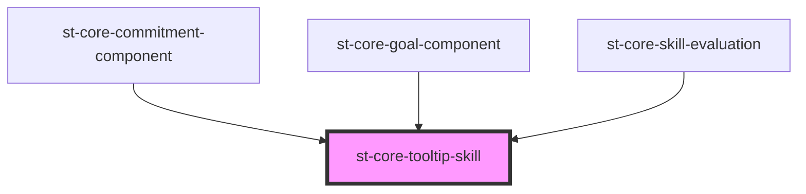

# st-core-tooltip-skill

<!-- Auto Generated Below -->

## Properties

| Property              | Attribute               | Description | Type      | Default     |
| --------------------- | ----------------------- | ----------- | --------- | ----------- |
| `hasDescriptionClass` | `has-description-class` |             | `boolean` | `false`     |
| `position`            | `position`              |             | `string`  | `'rigth'`   |
| `suggested`           | `suggested`             |             | `boolean` | `undefined` |
| `text`                | `text`                  |             | `string`  | `''`        |

## Shadow Parts

| Part              | Description |
| ----------------- | ----------- |
| `"tooltip-skill"` |             |
| `"tooltip-text"`  |             |

## Dependencies

### Used by

 - [st-core-skill-evaluation](../..)

### Graph

----------------------------------------------

*Built with [StencilJS](https://stenciljs.com/)*
