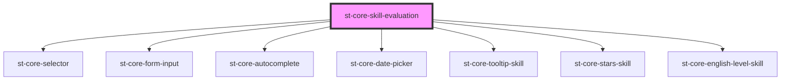

# st-core-skill-evaluation

<!-- Auto Generated Below -->

## Properties

| Property             | Attribute              | Description | Type             | Default     |
| -------------------- | ---------------------- | ----------- | ---------------- | ----------- |
| `disciplinesField`   | --                     |             | `OptionsModel[]` | `undefined` |
| `evaluatedName`      | `evaluated-name`       |             | `string`         | `''`        |
| `evaluatorName`      | `evaluator-name`       |             | `string`         | `undefined` |
| `formInfo`           | --                     |             | `FormModel`      | `undefined` |
| `formName`           | `form-name`            |             | `string`         | `''`        |
| `initialDiscipline`  | `initial-discipline`   |             | `string`         | `''`        |
| `isASingleSkill`     | `is-a-single-skill`    |             | `boolean`        | `false`     |
| `readOnly`           | `read-only`            |             | `boolean`        | `false`     |
| `showDownloadButton` | `show-download-button` |             | `boolean`        | `false`     |
| `showInfoPanel`      | `show-info-panel`      |             | `boolean`        | `true`      |
| `skill`              | --                     |             | `SkillModel`     | `undefined` |
| `skills`             | --                     |             | `SkillModel[]`   | `[]`        |
| `users`              | --                     |             | `UserModel[]`    | `[]`        |

## Events

| Event                | Description | Type                  |
| -------------------- | ----------- | --------------------- |
| `addNewSkill`        |             | `CustomEvent<string>` |
| `downloadReport`     |             | `CustomEvent<string>` |
| `inputEmployee`      |             | `CustomEvent<string>` |
| `savedPartial`       |             | `CustomEvent<string>` |
| `selectedDate`       |             | `CustomEvent<string>` |
| `selectedDiscipline` |             | `CustomEvent<string>` |
| `selectedEmployee`   |             | `CustomEvent<string>` |
| `submitEvent`        |             | `CustomEvent<any>`    |

## Methods

### `clearData() => Promise<void>`

#### Returns

Type: `Promise<void>`

### `savePartial() => Promise<void>`

#### Returns

Type: `Promise<void>`

## Dependencies

### Depends on

- [st-core-selector](../core-selector)
- [st-core-form-input](../form-input)
- [st-core-autocomplete](../autocomplete)
- [st-core-date-picker](../st-core-date-picker)
- [st-core-tooltip-skill](./components/tooltip-skill)
- [st-core-stars-skill](./components/stars-skill)
- [st-core-english-level-skill](./components/st-core-english-level-skill)

### Graph

----------------------------------------------

*Built with [StencilJS](https://stenciljs.com/)*
