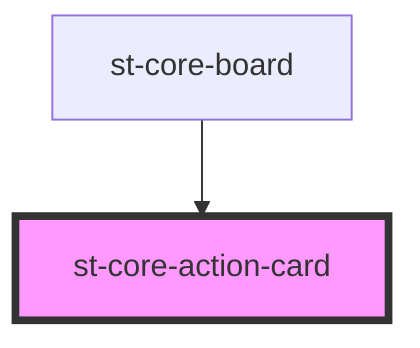

# st-core-action-card

<!-- Auto Generated Below -->

## Properties

| Property | Attribute | Description | Type                     | Default |
| -------- | --------- | ----------- | ------------------------ | ------- |
| `action` | --        |             | `SubCategoriActionModel` | `{}`    |

## Events

| Event            | Description | Type                                    |
| ---------------- | ----------- | --------------------------------------- |
| `actionAccepted` |             | `CustomEvent<ActionGoalSuggestedModel>` |
| `actionInfo`     |             | `CustomEvent<string>`                   |
| `actionRejected` |             | `CustomEvent<ActionGoalSuggestedModel>` |
| `editAction`     |             | `CustomEvent<SubCategoriActionModel>`   |

## Dependencies

### Used by

 - [st-core-board](../st-core-board)

### Graph

----------------------------------------------

*Built with [StencilJS](https://stenciljs.com/)*
