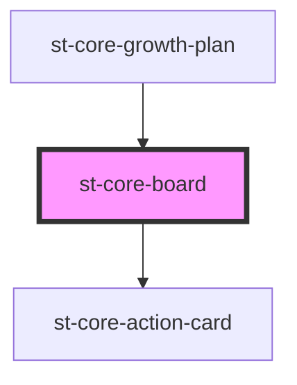

# st-core-board

<!-- Auto Generated Below -->

## Properties

| Property          | Attribute     | Description | Type          | Default |
| ----------------- | ------------- | ----------- | ------------- | ------- |
| `actionsToRender` | --            |             | `ActionModel` | `{}`    |
| `mentorMode`      | `mentor-mode` |             | `boolean`     | `false` |

## Events

| Event                          | Description | Type                                    |
| ------------------------------ | ----------- | --------------------------------------- |
| `actionSuggestedAcceptedBoard` |             | `CustomEvent<ActionGoalSuggestedModel>` |
| `actionSuggestedRejectedBoard` |             | `CustomEvent<ActionGoalSuggestedModel>` |
| `cardMoved`                    |             | `CustomEvent<StateModel>`               |
| `editDoingAction`              |             | `CustomEvent<SubCategoriActionModel>`   |
| `editDoneAction`               |             | `CustomEvent<SubCategoriActionModel>`   |
| `editSuspendedDeclinedAction`  |             | `CustomEvent<SubCategoriActionModel>`   |
| `editToDoAction`               |             | `CustomEvent<SubCategoriActionModel>`   |
| `errorsList`                   |             | `CustomEvent<ErrorsModel>`              |
| `goalSuggestedAcceptedBoard`   |             | `CustomEvent<string>`                   |
| `goalSuggestedRejectedBoard`   |             | `CustomEvent<string>`                   |
| `showActionInfoBoard`          |             | `CustomEvent<string>`                   |
| `showAddActionList`            |             | `CustomEvent<GoalModel>`                |
| `showGoalInfoList`             |             | `CustomEvent<string>`                   |
| `updateActionDateList`         |             | `CustomEvent<DueDateModel>`             |
| `updateActionStateList`        |             | `CustomEvent<StateModel>`               |
| `updateGoalDateList`           |             | `CustomEvent<DueDateModel>`             |
| `updateGoalStateList`          |             | `CustomEvent<StateModel>`               |

## Dependencies

### Used by

 - [st-core-growth-plan](../st-core-growth-plan)

### Depends on

- [st-core-action-card](../st-core-action-card)

### Graph

----------------------------------------------

*Built with [StencilJS](https://stenciljs.com/)*
