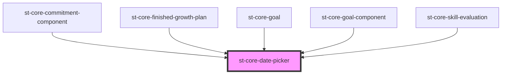

# st-core-date-picker

<!-- Auto Generated Below -->

## Properties

| Property     | Attribute     | Description | Type      | Default |
| ------------ | ------------- | ----------- | --------- | ------- |
| `classDate`  | `class-date`  |             | `string`  | `''`    |
| `isDisabled` | `is-disabled` |             | `boolean` | `false` |
| `max`        | `max`         |             | `string`  | `''`    |
| `min`        | `min`         |             | `string`  | `''`    |
| `value`      | `value`       |             | `string`  | `''`    |

## Events

| Event        | Description | Type               |
| ------------ | ----------- | ------------------ |
| `changeDate` |             | `CustomEvent<any>` |

## Methods

### `cleanInput() => Promise<void>`

#### Returns

Type: `Promise<void>`

## Dependencies

### Used by

 - [st-core-finished-growth-plan](../st-core-finished-growth-plan)
 - [st-core-goal](../st-core-goal)
 - [st-core-skill-evaluation](../skill-evaluation)

### Graph

----------------------------------------------

*Built with [StencilJS](https://stenciljs.com/)*
