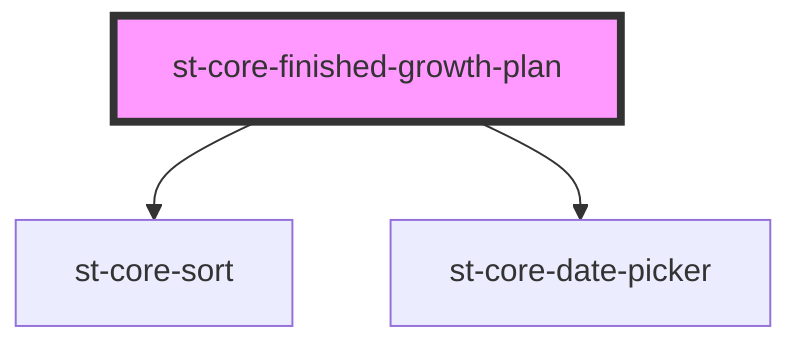

# st-core-finished-growth-plan

<!-- Auto Generated Below -->

## Properties

| Property       | Attribute | Description | Type        | Default     |
| -------------- | --------- | ----------- | ----------- | ----------- |
| `finishedPlan` | --        |             | `PlanModel` | `undefined` |

## Events

| Event            | Description | Type                                                                                |
| ---------------- | ----------- | ----------------------------------------------------------------------------------- |
| `filters`        |             | `CustomEvent<{ goal: string; state: string; startDate: string; endDate: string; }>` |
| `showActionInfo` |             | `CustomEvent<string>`                                                               |
| `showGoalInfo`   |             | `CustomEvent<string>`                                                               |
| `sort`           |             | `CustomEvent<SortEvent>`                                                            |

## Dependencies

### Depends on

- [st-core-sort](../st-core-sort)
- [st-core-date-picker](../st-core-date-picker)

### Graph

----------------------------------------------

*Built with [StencilJS](https://stenciljs.com/)*
