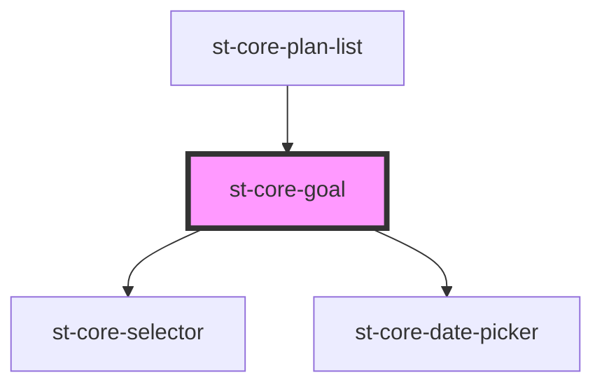

# st-core-goal

<!-- Auto Generated Below -->

## Properties

| Property        | Attribute     | Description | Type             | Default     |
| --------------- | ------------- | ----------- | ---------------- | ----------- |
| `goal`          | --            |             | `GoalModel`      | `undefined` |
| `mentorMode`    | `mentor-mode` |             | `boolean`        | `undefined` |
| `statusOptions` | --            |             | `OptionsModel[]` | `undefined` |

## Events

| Event            | Description | Type                                    |
| ---------------- | ----------- | --------------------------------------- |
| `actionAccepted` |             | `CustomEvent<ActionGoalSuggestedModel>` |
| `actionDate`     |             | `CustomEvent<DueDateModel>`             |
| `actionInfo`     |             | `CustomEvent<string>`                   |
| `actionRejected` |             | `CustomEvent<ActionGoalSuggestedModel>` |
| `actionState`    |             | `CustomEvent<StateModel>`               |
| `addAction`      |             | `CustomEvent<GoalModel>`                |
| `goalAccepted`   |             | `CustomEvent<string>`                   |
| `goalDate`       |             | `CustomEvent<DueDateModel>`             |
| `goalErrors`     |             | `CustomEvent<ErrorsModel>`              |
| `goalInfo`       |             | `CustomEvent<string>`                   |
| `goalRejected`   |             | `CustomEvent<string>`                   |
| `goalState`      |             | `CustomEvent<StateModel>`               |

## Dependencies

### Used by

 - [st-core-plan-list](../st-core-plan-list)

### Depends on

- [st-core-selector](../core-selector)
- [st-core-date-picker](../st-core-date-picker)

### Graph

----------------------------------------------

*Built with [StencilJS](https://stenciljs.com/)*
