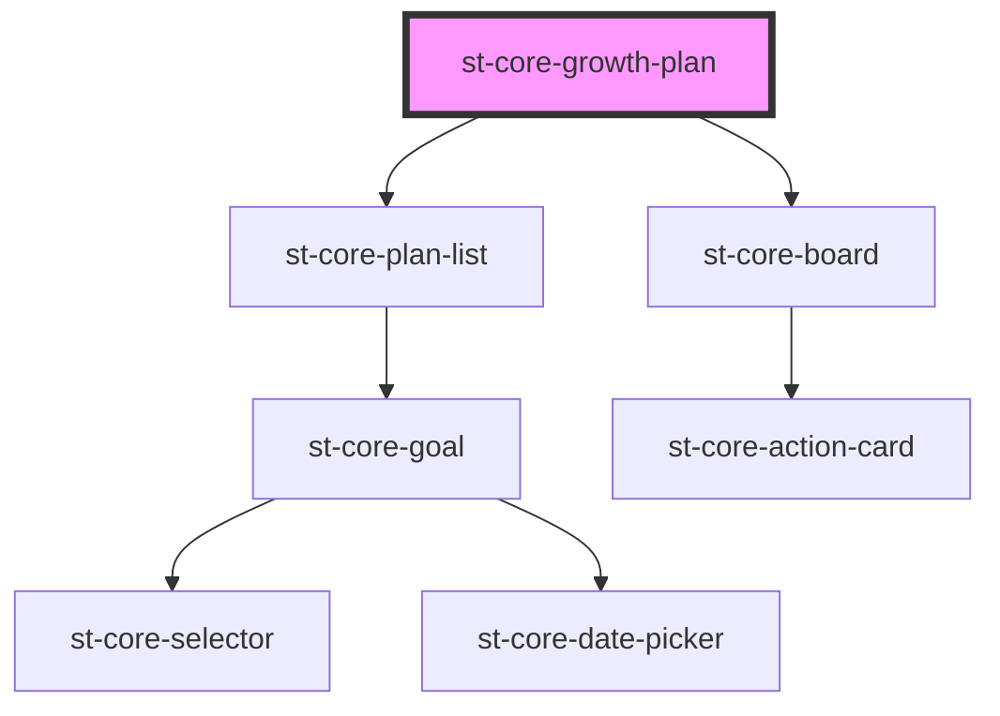

# st-core-growth-plan

<!-- Auto Generated Below -->

## Properties

| Property           | Attribute            | Description | Type        | Default     |
| ------------------ | -------------------- | ----------- | ----------- | ----------- |
| `currentPlanBoard` | `current-plan-board` |             | `any`       | `undefined` |
| `listMode`         | `list-mode`          |             | `boolean`   | `true`      |
| `mentorMode`       | `mentor-mode`        |             | `boolean`   | `false`     |
| `mentors`          | --                   |             | `string[]`  | `undefined` |
| `plan`             | --                   |             | `PlanModel` | `undefined` |

## Events

| Event                     | Description | Type                                    |
| ------------------------- | ----------- | --------------------------------------- |
| `actionSuggestedAccepted` |             | `CustomEvent<ActionGoalSuggestedModel>` |
| `actionSuggestedRejected` |             | `CustomEvent<ActionGoalSuggestedModel>` |
| `addGoal`                 |             | `CustomEvent<boolean>`                  |
| `errors`                  |             | `CustomEvent<ErrorsModel>`              |
| `filterPlanByName`        |             | `CustomEvent<string>`                   |
| `finishPlan`              |             | `CustomEvent<PlanModel>`                |
| `goalSuggestedAccepted`   |             | `CustomEvent<string>`                   |
| `goalSuggestedRejected`   |             | `CustomEvent<string>`                   |
| `seeHistory`              |             | `CustomEvent<boolean>`                  |
| `showActionInfo`          |             | `CustomEvent<string>`                   |
| `showAddAction`           |             | `CustomEvent<GoalModel>`                |
| `showBoardAddAction`      |             | `CustomEvent<boolean>`                  |
| `showBoardEditAction`     |             | `CustomEvent<SubCategoriActionModel>`   |
| `showGoalInfo`            |             | `CustomEvent<string>`                   |
| `switchMode`              |             | `CustomEvent<boolean>`                  |
| `updateActionDate`        |             | `CustomEvent<DueDateModel>`             |
| `updateActionState`       |             | `CustomEvent<StateModel>`               |
| `updateGoalDate`          |             | `CustomEvent<DueDateModel>`             |
| `updateGoalState`         |             | `CustomEvent<StateModel>`               |
| `updateMentors`           |             | `CustomEvent<boolean>`                  |
| `updateProjection`        |             | `CustomEvent<string>`                   |

## Methods

### `clearFilter() => Promise<void>`

#### Returns

Type: `Promise<void>`

## Dependencies

### Depends on

- [st-core-plan-list](../st-core-plan-list)
- [st-core-board](../st-core-board)

### Graph

----------------------------------------------

*Built with [StencilJS](https://stenciljs.com/)*
