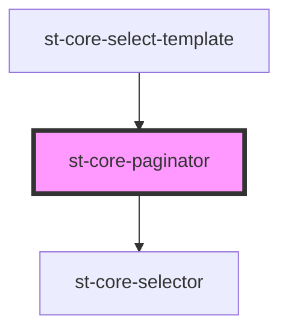

# core-paginator

<!-- Auto Generated Below -->

## Properties

| Property     | Attribute     | Description | Type     | Default     |
| ------------ | ------------- | ----------- | -------- | ----------- |
| `page`       | `page`        |             | `number` | `1`         |
| `pageSize`   | `page-size`   |             | `number` | `5`         |
| `totalItems` | `total-items` |             | `number` | `undefined` |

## Events

| Event            | Description | Type               |
| ---------------- | ----------- | ------------------ |
| `changePage`     |             | `CustomEvent<any>` |
| `changePageSize` |             | `CustomEvent<any>` |

## Dependencies

### Used by

 - [st-core-select-template](../select-template)

### Depends on

- [st-core-selector](../core-selector)

### Graph

----------------------------------------------

*Built with [StencilJS](https://stenciljs.com/)*
