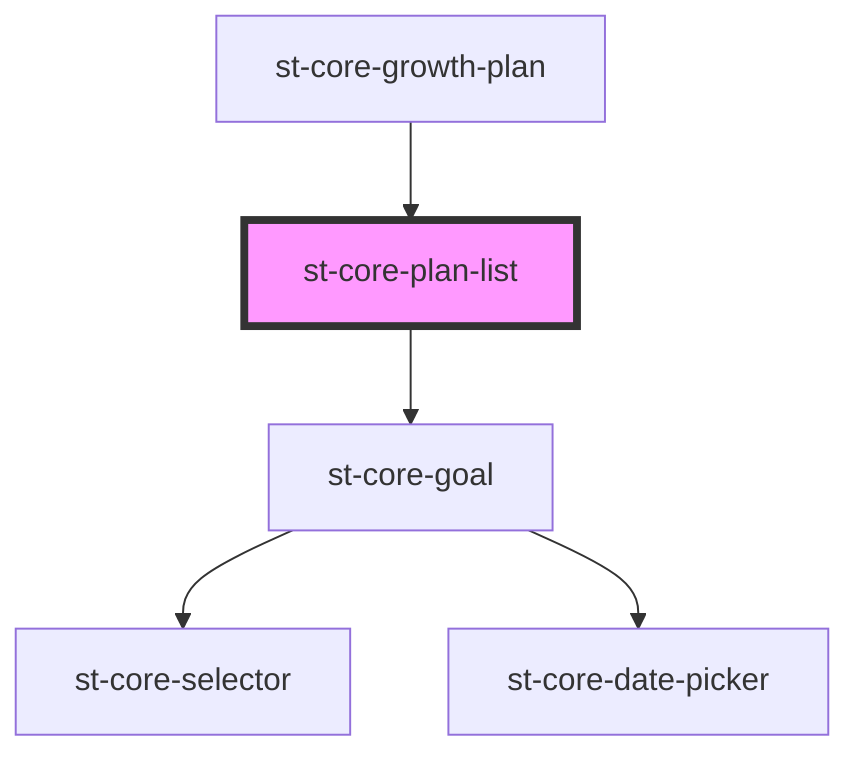

# st-core-plan-list

<!-- Auto Generated Below -->

## Properties

| Property        | Attribute     | Description | Type                                       | Default     |
| --------------- | ------------- | ----------- | ------------------------------------------ | ----------- |
| `goalsToRender` | --            |             | `{ state: number; goals: GoalModel[]; }[]` | `undefined` |
| `mentorMode`    | `mentor-mode` |             | `boolean`                                  | `false`     |

## Events

| Event                         | Description | Type                                    |
| ----------------------------- | ----------- | --------------------------------------- |
| `actionSuggestedAcceptedList` |             | `CustomEvent<ActionGoalSuggestedModel>` |
| `actionSuggestedRejectedList` |             | `CustomEvent<ActionGoalSuggestedModel>` |
| `cardMoved`                   |             | `CustomEvent<StateModel>`               |
| `errorsList`                  |             | `CustomEvent<ErrorsModel>`              |
| `goalSuggestedAcceptedList`   |             | `CustomEvent<string>`                   |
| `goalSuggestedRejectedList`   |             | `CustomEvent<string>`                   |
| `showActionInfoList`          |             | `CustomEvent<string>`                   |
| `showAddActionList`           |             | `CustomEvent<GoalModel>`                |
| `showGoalInfoList`            |             | `CustomEvent<string>`                   |
| `updateActionDateList`        |             | `CustomEvent<DueDateModel>`             |
| `updateActionStateList`       |             | `CustomEvent<StateModel>`               |
| `updateGoalDateList`          |             | `CustomEvent<DueDateModel>`             |
| `updateGoalStateList`         |             | `CustomEvent<StateModel>`               |

## Dependencies

### Used by

 - [st-core-growth-plan](../st-core-growth-plan)

### Depends on

- [st-core-goal](../st-core-goal)

### Graph

----------------------------------------------

*Built with [StencilJS](https://stenciljs.com/)*
