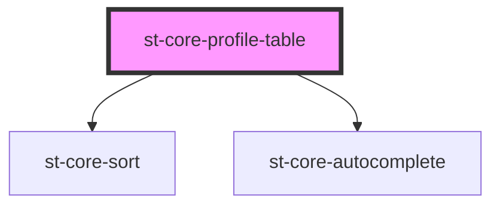

# st-core-profile-table

<!-- Auto Generated Below -->

## Properties

| Property  | Attribute  | Description | Type                                                                | Default |
| --------- | ---------- | ----------- | ------------------------------------------------------------------- | ------- |
| `data`    | --         |             | `{ discipline: string; forms: { id: string; name: string; }[]; }[]` | `[]`    |
| `isAdmin` | `is-admin` |             | `boolean`                                                           | `false` |

## Events

| Event        | Description | Type                  |
| ------------ | ----------- | --------------------- |
| `deleteForm` |             | `CustomEvent<string>` |

## Dependencies

### Depends on

- [st-core-sort](../st-core-sort)
- [st-core-autocomplete](../autocomplete)

### Graph

----------------------------------------------

*Built with [StencilJS](https://stenciljs.com/)*
