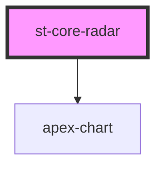

# st-core-radar

<!-- Auto Generated Below -->

## Properties

| Property       | Attribute     | Description | Type           | Default        |
| -------------- | ------------- | ----------- | -------------- | -------------- |
| `categories`   | --            |             | `string[]`     | `[]`           |
| `colors`       | --            |             | `ColorsStatus` | `undefined`    |
| `options`      | --            |             | `{}`           | `{}`           |
| `radarTitle`   | `radar-title` |             | `string`       | `'Radar test'` |
| `targetStatus` | --            |             | `number[]`     | `[]`           |
| `testMode`     | `test-mode`   |             | `boolean`      | `false`        |
| `userStatus`   | --            |             | `number[]`     | `[]`           |

## Dependencies

### Depends on

- apex-chart

### Graph

----------------------------------------------

*Built with [StencilJS](https://stenciljs.com/)*
