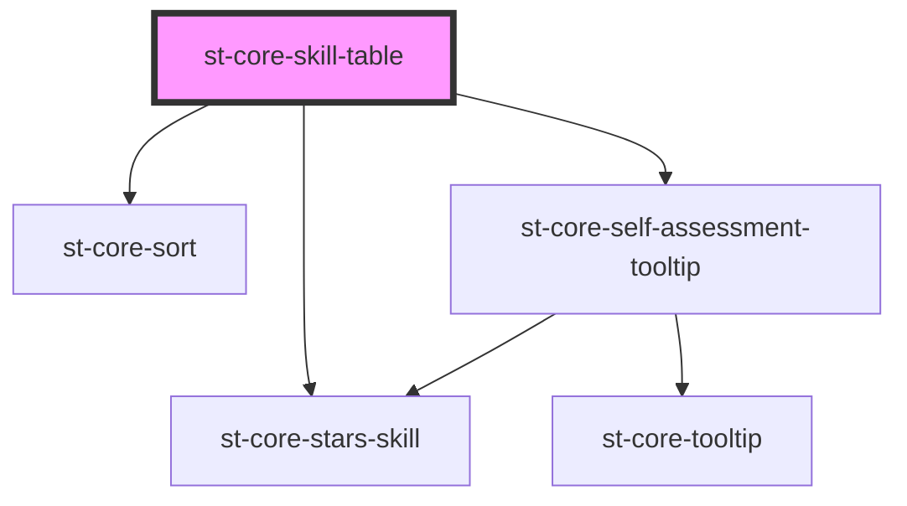

# st-core-skill-table

<!-- Auto Generated Below -->

## Properties

| Property        | Attribute         | Description | Type               | Default |
| --------------- | ----------------- | ----------- | ------------------ | ------- |
| `hasSoftSkills` | `has-soft-skills` |             | `boolean`          | `false` |
| `isEditable`    | `is-editable`     |             | `boolean`          | `true`  |
| `userSkills`    | --                |             | `UserSkillModel[]` | `[]`    |

## Events

| Event               | Description | Type                                                                                                                        |
| ------------------- | ----------- | --------------------------------------------------------------------------------------------------------------------------- |
| `filters`           |             | `CustomEvent<{ displayName: string; date: string; level: string; type: string; observation: string; discipline: string; }>` |
| `seeHistorical`     |             | `CustomEvent<{ skillId: string; }>`                                                                                         |
| `setSelfAssessment` |             | `CustomEvent<SelfAssessmentModel>`                                                                                          |
| `sort`              |             | `CustomEvent<SortEvent>`                                                                                                    |

## Dependencies

### Depends on

- [st-core-sort](../st-core-sort)
- [st-core-stars-skill](../skill-evaluation/components/stars-skill)
- [st-core-self-assessment-tooltip](../self-assessment-tooltip)

### Graph

----------------------------------------------

*Built with [StencilJS](https://stenciljs.com/)*
