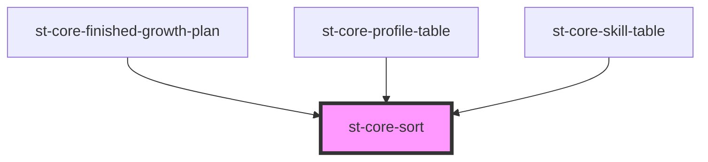

# st-core-sort

<!-- Auto Generated Below -->

## Properties

| Property   | Attribute  | Description | Type     | Default     |
| ---------- | ---------- | ----------- | -------- | ----------- |
| `column`   | `column`   |             | `string` | `''`        |
| `sortable` | `sortable` |             | `string` | `undefined` |

## Events

| Event  | Description | Type                     |
| ------ | ----------- | ------------------------ |
| `sort` |             | `CustomEvent<SortEvent>` |

## Dependencies

### Used by

 - [st-core-finished-growth-plan](../st-core-finished-growth-plan)
 - [st-core-profile-table](../st-core-profile-table)
 - [st-core-skill-table](../st-core-skill-table)

### Graph

----------------------------------------------

*Built with [StencilJS](https://stenciljs.com/)*
