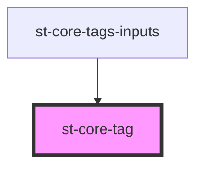

# st-core-tag

<!-- Auto Generated Below -->

## Properties

| Property  | Attribute | Description | Type      | Default     |
| --------- | --------- | ----------- | --------- | ----------- |
| `close`   | `close`   |             | `boolean` | `true`      |
| `element` | `element` |             | `any`     | `undefined` |
| `tag`     | `tag`     |             | `string`  | `undefined` |

## Events

| Event           | Description | Type               |
| --------------- | ----------- | ------------------ |
| `removeElement` |             | `CustomEvent<any>` |

## Dependencies

### Used by

 - [st-core-tags-inputs](../st-core-tags-inputs)

### Graph

----------------------------------------------

*Built with [StencilJS](https://stenciljs.com/)*
