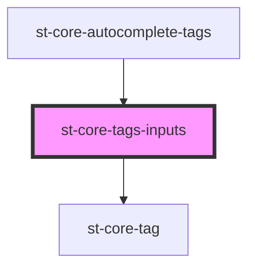

# st-core-tags-inputs

<!-- Auto Generated Below -->

## Properties

| Property      | Attribute     | Description | Type      | Default     |
| ------------- | ------------- | ----------- | --------- | ----------- |
| `canEnter`    | `can-enter`   |             | `boolean` | `false`     |
| `data`        | --            |             | `any[]`   | `[]`        |
| `isHidden`    | `is-hidden`   |             | `boolean` | `false`     |
| `isInTable`   | `is-in-table` |             | `boolean` | `false`     |
| `placeholder` | `placeholder` |             | `string`  | `undefined` |

## Events

| Event         | Description | Type                    |
| ------------- | ----------- | ----------------------- |
| `addElement`  |             | `CustomEvent<any>`      |
| `autoInput`   |             | `CustomEvent<string>`   |
| `setElements` |             | `CustomEvent<string[]>` |
| `upKey`       |             | `CustomEvent<boolean>`  |

## Dependencies

### Used by

 - [st-core-autocomplete-tags](../autocomplete-tags)

### Depends on

- [st-core-tag](../st-core-tag)

### Graph

----------------------------------------------

*Built with [StencilJS](https://stenciljs.com/)*
