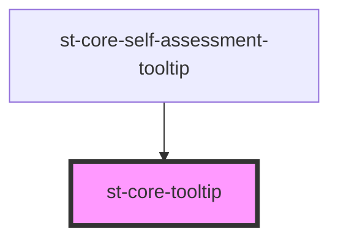

# st-core-tooltip

<!-- Auto Generated Below -->

## Properties

| Property          | Attribute          | Description | Type         | Default                 |
| ----------------- | ------------------ | ----------- | ------------ | ----------------------- |
| `backgroundColor` | `background-color` |             | `string`     | `'black'`               |
| `color`           | `color`            |             | `string`     | `'transparent'`         |
| `isDisabled`      | `is-disabled`      |             | `boolean`    | `false`                 |
| `positionTooltip` | `position-tooltip` |             | `string`     | `PositionOptions.right` |
| `size`            | `size`             |             | `"" \| "md"` | `''`                    |

## Methods

### `handlerChangeVisibility() => Promise<void>`

#### Returns

Type: `Promise<void>`

## Shadow Parts

| Part              | Description |
| ----------------- | ----------- |
| `"invisible-div"` |             |
| `"tooltip-card"`  |             |

## Dependencies

### Used by

 - [st-core-self-assessment-tooltip](../self-assessment-tooltip)

### Graph

----------------------------------------------

*Built with [StencilJS](https://stenciljs.com/)*
